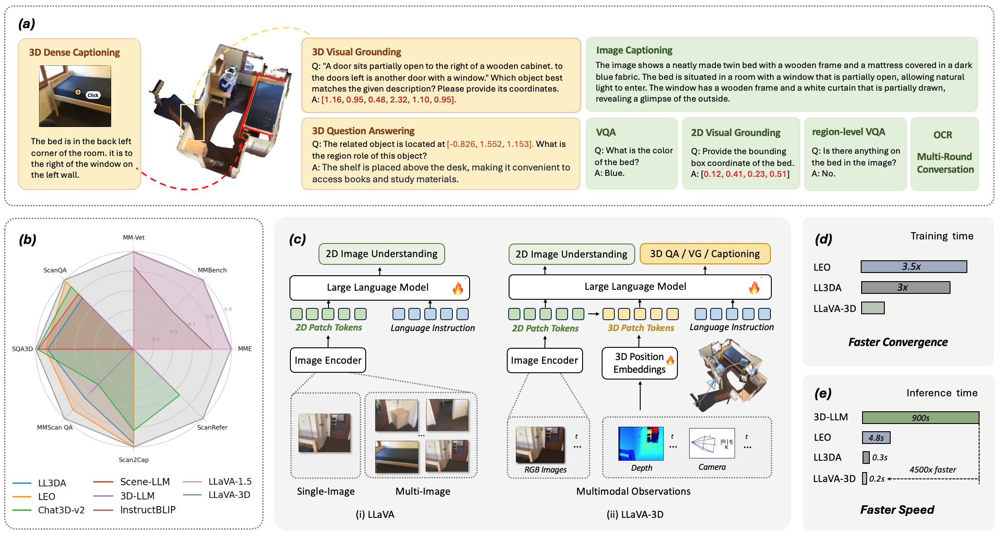
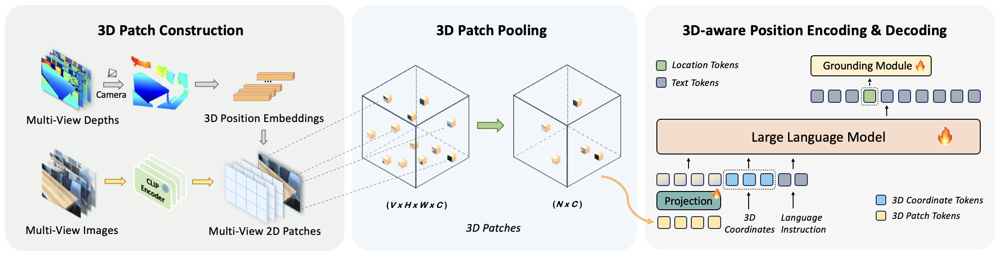

<br>
<p align="center">
<h1 align="center"><strong>LLaVA-3D: A Simple yet Effective Pathway to Empowering LMMs with 3D-awareness</strong></h1>
  <p align="center">
	<br>
    <a href='https://zcmax.github.io//' target='_blank'>Chenming Zhu</a>&emsp;
	<a href='https://tai-wang.github.io/' target='_blank'>Tai Wang*</a>&emsp;
    <a href='https://zhangwenwei.cn/' target='_blank'>Wenwei Zhang</a>&emsp;
    <a href='https://oceanpang.github.io/' target='_blank'>Jiangmiao Pang</a>&emsp;
	<a href='https://xh-liu.github.io//' target='_blank'>Xihui Liu*</a>&emsp;
    <br>
    The University of Hong Kong&emsp;Shanghai AI Laboratory
    <br>
  </p>
</p>


<div id="top" align="center">

[](https://zcmax.github.io/projects/LLaVA-3D/) 
[](https://zcmax.github.io/projects/LLaVA-3D/)

</div>


## 🏠 Introducing LLaVA-3D
<!--  -->

<div style="text-align: center;">
    
</div>
LLaVA-3D could perform both 2D and 3D vision-language tasks. The left block (b) shows that compared with previous 3D LMMs, our LLaVA-3D achieves state-of-the-art performance across a wide range of 3D benchmarks while maintaining a comparable performance on various 2D benchmarks compared with LLaVA-1.5. The middle block (c) demonstrates that LLaVA-3D is built on the 2D LMM: LLaVA, and leverages 3D patches to endow it with 3D spatial awareness, enabling it to perform various 3D vision-and-language tasks in the physical world. The right blocks (d) and (e) highlights the significantly faster convergence and inference speeds of LLaVA-3D compared to existing 3D LMMs.

## 📦 LLaVA-3D Architecture
<p align="center">
  
</p>
LLaVA-3D Architecture. Based on LLaVA, we directly add the corresponding 3D position embeddings to 2D patch visual tokens of multi-view images to construct the 3D Patches, then the 3D Patches will undergo 3D pooling and be sent into the projection layer of LLaVA to map into the LLM space and align with the LLM using 3D-visual-language data.


## 🛠️ Requirements and Installation
* Python >= 3.10
* Pytorch == 2.1.0
* CUDA Version >= 11.7
* Install required packages:
```bash
conda create -n llava python=3.10 -y
conda activate llava
pip install --upgrade pip  # enable PEP 660 support
pip install -e .
pip install -e ".[train]"
pip install flash-attn --no-build-isolation
pip install git+https://github.com/facebookresearch/pytorch3d.git@stablegit@28fe037d212663c6a24f373b94cc5d478c8c1a1d
pip install torch-scatter -f https://data.pyg.org/whl/torch-2.1.0+cu118.html
```

#### demo inference

You can use the fine-tuned model to infrence on the scene rgbd video on a single GPU:

```
./inference.sh
```

#### multi-gpu evaluation

Since current the `batch_size` during inference is fixed to be `1` due to some reason. To accelereate the evaluation speed, we now provide the the script of multi-gpu inference on SLURM.

```bash
bash eval_multiprocess_mmscan_qa_slurm.sh
```

You can simply modify it to run on the local device (non-slurm environment).

## Finetune LLaVA-3D on Custom Datasets

Convert your data to a JSON file of a List of all samples. Sample metadata should contain `id` (a unique identifier), `video` (the path to the video), and `conversations` (the conversation data between human and AI).

A sample JSON for finetuning LLaVA-3D for generating 3D scene caption.

```json
[
    {
        "id": 0,
        "video": "frames/scannet/scene0442_00",
        "conversations": [
            {
                "from": "human",
                "value": "<video>\nDescribe the room concisely."
            },
            {
                "from": "gpt",
                "value": "In the opulent living room, adorned with four chairs, four tables, and five armchairs, a symphony of elegance unfolds. The chairs, positioned in front of the tables, create an inviting space for conversation and relaxation. The tables, in turn, stand proudly behind the chairs, offering a surface for books, drinks, or cherished mementos. The armchairs, scattered throughout the room, beckon weary souls to sink into their plush embrace. This living room exudes comfort and sophistication, a sanctuary for both solitary contemplation and convivial gatherings."
            }
        ]
    },
  ...
]
```

## 📝 TODO List

- \[x\] Release training and inference code.
- \[ \] Release gradio demo.
- \[ \] Release checkpoints and datasets.

## 📄 License

<a rel="license" href="http://creativecommons.org/licenses/by-nc-sa/4.0/"></a>
<br />
This work is under the <a rel="license" href="http://creativecommons.org/licenses/by-nc-sa/4.0/">Creative Commons Attribution-NonCommercial-ShareAlike 4.0 International License</a>.

## 👏 Acknowledgements

This repo benefits from [3D-LLM](https://github.com/UMass-Foundation-Model/3D-LLM), [LLaVA](https://github.com/haotian-liu/LLaVA). 
